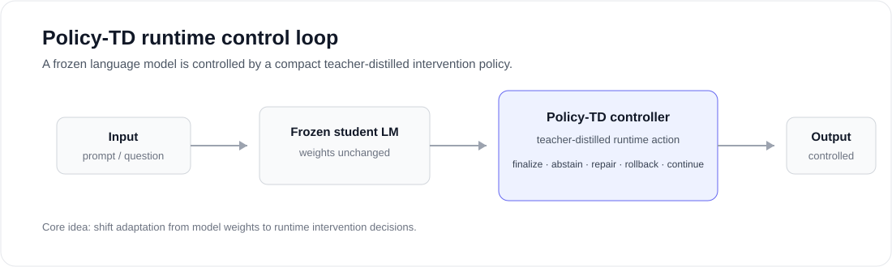
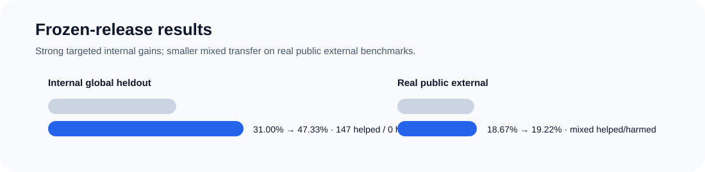

# Policy-TD

<p align="center">
  
</p>

<p align="center">
  <strong>Teacher-distilled runtime intervention policies for frozen small language models.</strong>
</p>

<p align="center">
  
  
  
</p>

## Manuscript

The current manuscript and supplementary material are included directly in this repository.

- [Policy-TD final manuscript](paper/Policy_TD_Final_Manuscript.pdf)
- [Supplementary information](paper/Policy_TD_Final_Supplementary_Information.pdf)
- [LaTeX manuscript source](paper/source/)
- [Manuscript changelog](paper/MANUSCRIPT_CHANGELOG.md)

The repository remains a curated public research artifact. Internal workbench scripts, provider transcripts, raw traces, credentials, exploratory runs, and unreleased checkpoints are intentionally not published.
## What Policy-TD is

Policy-TD studies **decision-space adaptation**: keeping a small language model frozen while learning a compact external policy that decides when the model should finalize, abstain, repair, roll back, request a grounded continuation, or continue normally.

The public repository is intentionally a **curated research artifact**, not a dump of the full experimental workbench. It exposes the stable method contract, teacher-label schema, runtime action vocabulary, paired evaluation metrics, curated frozen-result tables, provenance manifests, verification utilities, and tests. Raw provider transcripts, local workbench scripts, large generated traces, and unreleased checkpoints are intentionally excluded. See [`docs/public_release_scope.md`](docs/public_release_scope.md).

## Main evidence

| Evaluation | Condition | Base accuracy | Guided accuracy | Delta | Helped | Harmed |
|---|---|---:|---:|---:|---:|---:|
| Internal global heldout | `guided_v12_hardened` | 31.00% | 47.33% | +16.33 pp | 147 | 0 |
| Internal global heldout | `guided_v10_noharm` | 31.00% | 47.11% | +16.11 pp | 145 | 0 |
| Real public external | `guided_v12_hardened` | 18.67% | 19.22% | +0.56 pp | 35 | 15 |
| Real public external | `guided_v10_noharm` | 18.67% | 19.22% | +0.56 pp | 26 | 6 |

The internal result is strong but deliberately targeted. Public external transfer is much smaller and includes harms. Policy-TD is therefore **not** claimed to be a universal reasoning enhancer or a universal no-harm method.

<p align="center">
  
</p>

## Runtime action vocabulary

- `finalize`
- `say_unknown`
- `repair_final`
- `rollback`
- `force_grounded_step`
- `continue`

## Public artifact boundary

The repository is designed so that a reader can inspect the method contract and verify the arithmetic and provenance of the released summary evidence without publishing every internal experiment artifact.

**Included:**

- typed action and label contracts;
- validation utilities;
- paired helped/harmed metrics;
- curated frozen summary tables and benchmark reports;
- release/provenance manifests;
- unit tests and release checks;
- method, limitations, and artifact notes.

**Not included:**

- raw teacher/provider transcripts or credentials;
- local research workbench scripts and process logs;
- large generated trace directories;
- exploratory/prototype branches and failed-run residue;
- model checkpoints unless separately released;
- provider-specific orchestration that is not required to understand the public method contract.

This distinction matters scientifically: the public repository supports **artifact inspection and result traceability**. A full from-scratch reproduction additionally requires the frozen runtime/checkpoint assets described in the paper/release notes.

## Installation

```bash
python -m pip install -e ".[dev]"
```

## Verify the public release

```bash
pytest
ruff check src tests
policy-td-inspect-results --results-dir results/frozen_release/internal_plus_real_external
./scripts/check_release.sh
```

The result-inspection command validates basic arithmetic identities in the frozen tables before printing the pooled summary.

## Repository layout

```text
src/policy_td/
  core/       stable action vocabulary and constants
  labels/     teacher-label schema and validation
  runtime/    runtime decision utilities
  eval/       paired helped/harmed metrics and table validation
  data/       JSONL utilities
  cli/        command-line inspection tools

data/         benchmark reports and public schemas
docs/         method, limitations, scope, release, and reproducibility notes
results/      curated frozen-release tables and manifests
tests/        unit tests
scripts/      release and repository checks
```

## Frozen artifact

A public-clean frozen runtime archive is intended to accompany the manuscript/preprint release rather than live directly in git:

```text
Policy-TD_frozen_runtime_archive_v0.1.0.tar.gz
SHA-256: 92f8393af023988ecbaa1a434da5131a1d88040ad54fdb0bd5aad5fd2f7d3c0e
```

The archive contains curated runtime evidence and table-generation provenance. Any trained guide/checkpoint bundle should be released separately so that large binary artifacts do not obscure the inspectable repository.

## Citation

Software citation metadata is provided in [`CITATION.cff`](CITATION.cff). A preferred manuscript citation should be added once a stable preprint identifier exists.

## License

MIT License.
